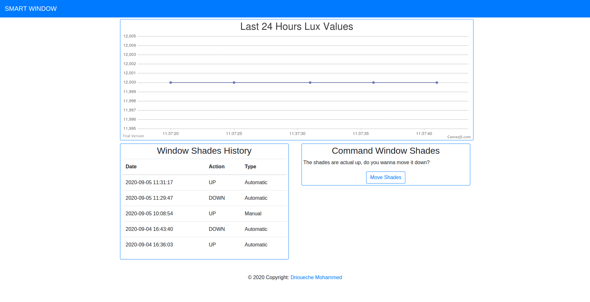

# smart-window

This is a Client/Server IoT project, Smart Window. 

This project:
- Automize the window shades to open and close automatically based on the outside sun light. 
- Contain a Dashboard (visualize the sun light lux value, and the shades position history).
- Add the ability to the client to command the shades from any place all over the world. 

**Notes:** 
- Due to the lack of Hardware, we simulate the hardware by a .txt file, for *actuators* we write in a file, and for *sensors* we read value from the file. 
- You can modify the file manipulation parts by the code of ur hardware based on hardware reference.
- Make sure to change the absolute paths in the project before deployment.

### Hardware
- Raspberry pi
- LDR
- Stepper motor *(In the file .txt i named "servo-moter" but it should be a Stepper motor  :no_mouth: )* 

### Server (Raspberry pi)
- Written in C, python and shell.
- Get data from sensors and command actuators.
- Save sensors values and actuators action to the database. 
- The database contains two tables: 
  - ldr table: contain values and time of saving.
  - motor_hitory table: contain time of changing position, direction (up/down, open/close) and type (manual/automatic).

### Client (Web Application)
- Written in php, javascript, html, and bootstrap for styling.
- Dashboard is mobile friendly.
- Dashboard for visualizing the system history and command the shades.

